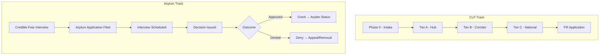

# Immigration Corridor System: Asylum Integration

---

## Overview

ICS operates parallel to, not in place of, the asylum system. This document details how asylum seekers interact with ICS, how protection claims are processed alongside corridor placement, and how the systems coordinate without compromising refugee protections.

---

## Relationship to Asylum System

### Core Principle

CLP status does not replace asylum. It provides lawful presence and stability while protection claims are adjudicated through existing legal channels.

| System | Purpose | ICS Relationship |
|--------|---------|------------------|
| **Asylum** | Protection from persecution | Preserved; claims processed independently |
| **Withholding of removal** | Non-refoulement protection | Preserved |
| **Convention Against Torture** | Torture protection | Preserved |
| **CLP** | Lawful presence and integration | Complementary status during adjudication |

---

## Intake Integration

### At Border Entry Points

| Step | Action | Timing |
|------|--------|--------|
| **1. Initial screening** | CBP conducts credible fear screening | 0-48 hours |
| **2. Protection flag** | Asylum intent flagged in ICS system | At intake |
| **3. CLP issuance** | Provisional CLP issued regardless of asylum claim | Day 1-3 |
| **4. Parallel tracking** | Asylum case and CLP advancement tracked separately | Ongoing |

### For Affirmative Asylum Seekers

| Situation | ICS Treatment |
|-----------|---------------|
| **Already in US, filing affirmatively** | Eligible for CLP if meeting general criteria |
| **Pending asylum case** | CLP does not prejudice asylum decision |
| **Asylum denied** | CLP continues; appeal rights preserved |
| **Asylum granted** | Transitions to asylee status; CLP terminates |

---

## Dual-Track Processing

### Parallel Timelines

### Key Integration Points

| Event | CLP Effect | Asylum Effect |
|-------|------------|---------------|
| **Credible fear found** | CLP continues | Case referred to court |
| **Credible fear not found** | CLP continues during appeal | Expedited removal unless appeal |
| **Asylum interview** | No CLP effect | Independent adjudication |
| **Asylum granted** | CLP terminates; asylee status | Full protection; path to PR |
| **Asylum denied** | CLP continues; can appeal | Appeal rights preserved |
| **Final denial + exhausted appeals** | CLP revocation review | Removal proceedings |

---

## Asylum Officer Capacity

### Current Backlog

| Metric | Current | ICS Target |
|--------|---------|------------|
| **Pending cases** | 3+ million | Reduce by 50% in 5 years |
| **Average wait time** | 4-6 years | Under 18 months |
| **Asylum officers** | ~600 | 1,500+ |
| **Immigration judges** | ~600 | 1,200+ |

### ICS Capacity Expansion

| Component | Investment |
|-----------|------------|
| **Asylum officer hiring** | 500+ new officers |
| **Immigration judge hiring** | 300+ new judges |
| **Legal aid funding** | $500M+ annually for asylum representation |
| **Case management systems** | Integrated tracking with CLP status |

---

## Protection-Sensitive Placement

### Vulnerability Screening

| Factor | Placement Consideration |
|--------|------------------------|
| **Trauma history** | Access to mental health services |
| **Country of origin** | Avoid placement near persecutor networks |
| **Language** | Interpreter availability |
| **Family separation** | Reunification priority |
| **LGBTQ+ asylum seekers** | Affirming community placement |
| **Religious persecution** | Faith community connections |

### Specialized Services

| Service | Availability |
|---------|--------------|
| **Trauma-informed case management** | All hub cities |
| **Specialized asylum legal clinics** | Hub cities + major corridors |
| **Cultural orientation** | Tailored to protection populations |
| **Mental health services** | Enhanced for asylum seekers |

---

## Credible Fear and Reasonable Fear

### Credible Fear Process Under ICS

| Stage | Current System | ICS Integration |
|-------|----------------|-----------------|
| **Screening** | At border/port | Same; plus CLP intake |
| **Interview** | Within 14 days | Same standard |
| **Positive finding** | Released or detained | CLP issued; hub placement |
| **Negative finding** | Expedited removal | CLP continues during IJ review |
| **IJ review** | Within 7 days | Same; CLP status preserved |

### Reasonable Fear (for those with prior orders)

| Situation | ICS Treatment |
|-----------|---------------|
| **Prior removal order** | Reasonable fear screening required |
| **Positive finding** | Withholding-only proceedings; CLP eligible |
| **Negative finding** | Removal; no CLP |

---

## Asylum Grant Transition

### From CLP to Asylee Status

| Step | Timeline | Action |
|------|----------|--------|
| **1. Grant issued** | Day 0 | Asylum officer/IJ grants asylum |
| **2. CLP termination** | Day 0 | Automatic; no action required |
| **3. Asylee documentation** | Days 1-30 | I-94, EAD issued |
| **4. Benefits transition** | Immediate | Asylee benefits replace CLP benefits |
| **5. Family reunification** | Eligible | Can petition for spouse/children |

### Asylee Benefits vs. CLP

| Benefit | CLP | Asylee |
|---------|-----|--------|
| **Work authorization** | Yes | Yes |
| **Geographic mobility** | Tiered | Full |
| **Federal benefits** | Limited | Full (most) |
| **Family petition** | No | Yes (I-730) |
| **Path to PR** | Via tiers | After 1 year |
| **Path to citizenship** | Via PR | Via PR (after 1 year) |

---

## Asylum Denial and Appeals

### Post-Denial Options

| Outcome | CLP Status | Next Steps |
|---------|------------|------------|
| **Denial by asylum officer** | Continues | Case referred to IJ |
| **Denial by IJ** | Continues | BIA appeal (30 days) |
| **BIA denial** | Continues | Federal court review |
| **Federal court denial** | Review triggered | Removal or other relief |
| **All appeals exhausted** | Revocation review | Removal proceedings |

### CLP Preservation During Appeals

- CLP status continues through all appeals
- Work authorization maintained
- Geographic tier preserved
- No automatic removal until final order

---

## Withholding and CAT

### Withholding of Removal

| Feature | Description |
|---------|-------------|
| **Standard** | More likely than not to face persecution |
| **Effect** | Cannot be removed to specific country |
| **CLP interaction** | CLP continues; withholding provides additional protection |
| **Path forward** | No direct path to PR; CLP provides integration |

### Convention Against Torture (CAT)

| Feature | Description |
|---------|-------------|
| **Standard** | More likely than not to face torture |
| **Effect** | Cannot be removed to specific country |
| **CLP interaction** | CLP continues; CAT provides removal protection |
| **Deferral vs. withholding** | Deferral can be terminated if conditions change |

---

## Unaccompanied Minors and Asylum

### Special Protections

| Protection | Source | ICS Compliance |
|------------|--------|----------------|
| **TVPRA screening** | Trafficking Victims Protection Act | Maintained |
| **USCIS initial jurisdiction** | TVPRA | Maintained for UACs |
| **Best interest standard** | Flores, TVPRA | Applied to all decisions |
| **Legal representation** | ICS funding | Enhanced for UAC asylum |

### UAC Asylum Process

| Stage | Handler | ICS Integration |
|-------|---------|-----------------|
| **Initial screening** | ORR/USCIS | CLP issued; ORR custody |
| **Asylum interview** | USCIS (non-adversarial) | Continued ORR/sponsor placement |
| **Grant** | USCIS | Asylee status; ORR services continue |
| **Referral to court** | IJ | CLP continues; legal aid provided |

---

## Country Conditions and Designation

### Temporary Protected Status (TPS) Interaction

| Situation | ICS Treatment |
|-----------|---------------|
| **TPS country designated** | TPS holders eligible for CLP |
| **TPS terminated** | CLP provides alternative pathway |
| **New TPS designation** | CLP holders can apply for TPS |

### Deferred Enforced Departure (DED)

| Situation | ICS Treatment |
|-----------|---------------|
| **DED designated** | DED holders eligible for CLP |
| **DED terminated** | CLP provides integration pathway |

---

## Fraud Prevention in Asylum Claims

### Integrity Measures

| Measure | Purpose |
|---------|---------|
| **Country conditions research** | Verify claimed conditions |
| **Consistency analysis** | Cross-reference interview statements |
| **Document verification** | Authenticate supporting documents |
| **Background checks** | Security screening regardless of claim |

### Frivolous Filing Consequences

| Finding | Consequence |
|---------|-------------|
| **Frivolous asylum application** | Permanent asylum bar (existing law) |
| **CLP effect** | Fraud finding triggers CLP review |
| **Due process** | Right to contest frivolous finding |

---

## Coordination with UNHCR

### Refugee Resettlement

| Component | ICS Role |
|-----------|----------|
| **Overseas processing** | Not affected; separate system |
| **Arrival in US** | Refugees not in CLP (already have status) |
| **Secondary migration** | Refugees can move to corridor cities |
| **Services** | Refugees can access ICS-funded services |

### UNHCR Consultation

| Area | Coordination |
|------|--------------|
| **Protection standards** | UNHCR guidance incorporated |
| **Country conditions** | UNHCR reports used in adjudication |
| **Vulnerable populations** | UNHCR referrals accepted |

---

## Metrics and Reporting

### Asylum-Specific Metrics

| Metric | Frequency |
|--------|-----------|
| **Credible fear pass rate** | Monthly |
| **Asylum grant rate** | Quarterly |
| **Average processing time** | Monthly |
| **Backlog size** | Monthly |
| **Legal representation rate** | Quarterly |

### Protection Outcomes

| Outcome | Tracking |
|---------|----------|
| **Asylum grants** | By nationality, hub city, representation status |
| **Withholding grants** | Same breakdowns |
| **CAT grants** | Same breakdowns |
| **Appeals success rate** | By court, representation status |

---

## Related Documents

- [Legal Framework](09-legal-framework.md) - CLP status details
- [Unaccompanied Minors](11-unaccompanied-minors.md) - UAC protections
- [Oversight](12-oversight.md) - Due process requirements
- [Implementation](15-implementation.md) - Asylum officer capacity

---

## Document Navigation

- Previous: [Implementation](15-implementation.md)
- Next: [Family Unity](17-family-unity.md)
