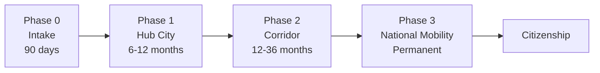

# Immigration Corridor System (ICS)

A comprehensive immigration reform proposal for the United States that replaces binary enforcement-or-amnesty approaches with phased, incentive-driven integration infrastructure.

## Quick Start

- **Start here:** [01-overview.md](01-overview.md) - Mission, executive summary, system at a glance
- **Original plan:** [00-initial-plan.md](00-initial-plan.md) - Full original document before modularization

## Core Concept

ICS grants provisional lawful presence immediately upon intake, then channels participants through a tiered geographic progression:

Key innovations:

- **Corridor Lawful Presence (CLP):** New immigration status providing legal presence from day one
- **Geographic distribution:** Hub and corridor cities prevent overconcentration
- **Resident Integration Dividend (RID):** Compensation payments to host communities
- **Benchmark progression:** Clear, objective criteria for advancement (no subjective tests)
- **Legacy Resident Adjustment:** Parallel track for long-term undocumented residents

## Document Structure

### Core Documents (01-30)

| # | Document | Content |
|---|----------|---------|
| 01 | [overview](01-overview.md) | Mission, executive summary, design philosophy |
| 02 | [system-architecture](02-system-architecture.md) | End-to-end flow, status tiers, phase progression |
| 03 | [geographic-design](03-geographic-design.md) | Hub cities, corridor cities, rural placement |
| 04 | [housing](04-housing.md) | Placement algorithm, supply coordination |
| 05 | [community-integration](05-community-integration.md) | RID payments, host community strategy |
| 06 | [education-workforce](06-education-workforce.md) | Two-generation strategy, employer engagement |
| 07 | [safety-fraud](07-safety-fraud.md) | Crime prevention, fraud resistance |
| 08 | [fiscal-architecture](08-fiscal-architecture.md) | Budget, funding mechanisms |
| 09 | [legal-framework](09-legal-framework.md) | CLP status, interstate compact |
| 10 | [enforcement](10-enforcement.md) | Removal pathways, surge mode |
| 11 | [unaccompanied-minors](11-unaccompanied-minors.md) | UC protocol, TVPRA compliance |
| 12 | [oversight](12-oversight.md) | Civil liberties, transparency |
| 13 | [political-path](13-political-path.md) | Enactment strategy, coalitions |
| 14 | [eligibility-matrix](14-eligibility-matrix.md) | Benefits and rights by status |
| 15 | [implementation](15-implementation.md) | Agencies, staffing, timelines |
| 16 | [asylum-integration](16-asylum-integration.md) | Asylum seeker pathways |
| 17 | [family-unity](17-family-unity.md) | Mixed-status families, reunification |
| 18 | [healthcare-detail](18-healthcare-detail.md) | Clinic operations, mental health |
| 19 | [language-services](19-language-services.md) | ESL programs, interpretation |
| 20 | [transportation](20-transportation.md) | Mobility by tier, transit |
| 21 | [employer-compliance](21-employer-compliance.md) | Employer registration, worker protections |
| 22 | [appeals-due-process](22-appeals-due-process.md) | Administrative hearings, judicial review |
| 23 | [emergency-protocols](23-emergency-protocols.md) | Disaster, pandemic, political disruption |
| 24 | [civic-integration](24-civic-integration.md) | Civic education, naturalization prep |
| 25 | [intergovernmental](25-intergovernmental.md) | Federal-state-local-tribal coordination |
| 26 | [criminal-justice](26-criminal-justice.md) | Criminal justice interaction |
| 27 | [special-populations](27-special-populations.md) | Refugees, TPS, DACA, U/T visa |
| 28 | [international-operations](28-international-operations.md) | Source country coordination |
| 29 | [metrics-evaluation](29-metrics-evaluation.md) | KPIs, outcome tracking |
| 30 | [perspectives](30-perspectives.md) | Political perspectives analysis |

### Appendices (A-Z)

Technical reference materials in [appendices/](appendices/):

| Appendix | Content |
|----------|---------|
| A | [Legislative text](appendices/A-legislative-text.md) - Draft statutory language |
| B | [Regulatory authorities](appendices/B-regulatory-authorities.md) - Agency rulemaking |
| C | [Comparison systems](appendices/C-comparison-systems.md) - International models |
| D | [Cost methodology](appendices/D-cost-methodology.md) - Budget assumptions |
| E | [Risk register](appendices/E-risk-register.md) - Failure mode analysis |
| F | [Media stress test](appendices/F-media-stress-test.md) - Misrepresentation analysis |
| G | [Glossary](appendices/G-glossary.md) - Key term definitions |
| H | [FAQ](appendices/H-faq.md) - Frequently asked questions |
| I | [Case studies](appendices/I-case-studies.md) - Hypothetical participant journeys |
| J | [Data architecture](appendices/J-data-architecture.md) - IT systems and data flows |
| K | [Model compact](appendices/K-model-compact.md) - Full interstate compact text |
| L | [Stakeholder templates](appendices/L-stakeholder-templates.md) - City resolutions, MOUs |
| M | [Visual diagrams](appendices/M-visual-diagrams.md) - System flow diagrams |
| N | [Research gaps](appendices/N-research-gaps.md) - Areas needing more research |
| O | [Pilot design](appendices/O-pilot-design.md) - Pilot program specifications |
| P | [Sample forms](appendices/P-sample-forms.md) - Application forms |
| Q | [Training curriculum](appendices/Q-training-curriculum.md) - Staff training modules |
| R | [Economic impact](appendices/R-economic-impact.md) - Labor market analysis |
| S | [Constitutional analysis](appendices/S-constitutional-analysis.md) - Legal issues |
| T | [Transition scenarios](appendices/T-transition-scenarios.md) - Political continuity |
| U | [Model regulations](appendices/U-model-regulations.md) - Draft CFR text |
| V | [Messaging guide](appendices/V-messaging-guide.md) - Talking points |
| W | [Bilateral templates](appendices/W-bilateral-templates.md) - Model agreements |
| X | [Technology specifications](appendices/X-technology-specifications.md) - IT specs |
| Y | [Metrics dashboard](appendices/Y-metrics-dashboard.md) - KPI definitions |
| Z | [Implementation checklist](appendices/Z-implementation-checklist.md) - Launch checklists |

### Other Files

- [todo.md](todo.md) - Image generation tasks and pending work
- [proposals/](proposals/) - Supplementary proposals

## Design Principles

| Principle | Description |
|-----------|-------------|
| Legal from Day One | No criminalization of presence |
| Progression, Not Permanence | No indefinite limbo; every status has exit ramps |
| Incentives Over Force | Advancement earned; stagnation tolerated but not rewarded |
| Load Compensation | Communities performing integration are paid |
| Fraud Resistance by Design | Low-yield, high-friction cheating |
| Civil Liberties First | Enforcement bounded, appealable, independently overseen |
| Antifragility | System slows or reroutes under stress instead of collapsing |

## What ICS Is Not

- **Not amnesty:** CLP is provisional status requiring demonstrated integration
- **Not open borders:** Geographic restrictions and capacity limits apply
- **Not permanent second-class status:** Clear path to permanent residency and citizenship
- **Not mandatory detention:** Liberty-respecting with due process throughout
- **Not cultural assimilation:** Objective benchmarks (language, employment, law compliance)

## Initial Geographic Focus

The Great Lakes Corridor serves as the initial implementation region:

- **Hub cities:** Buffalo, Cleveland, Detroit, Milwaukee, Pittsburgh
- **Corridor cities:** Erie, Toledo, Akron, Grand Rapids, Youngstown, Flint
- **Future expansion:** Appalachian, Upper Midwest, Gulf Coast, Southern Tier corridors
