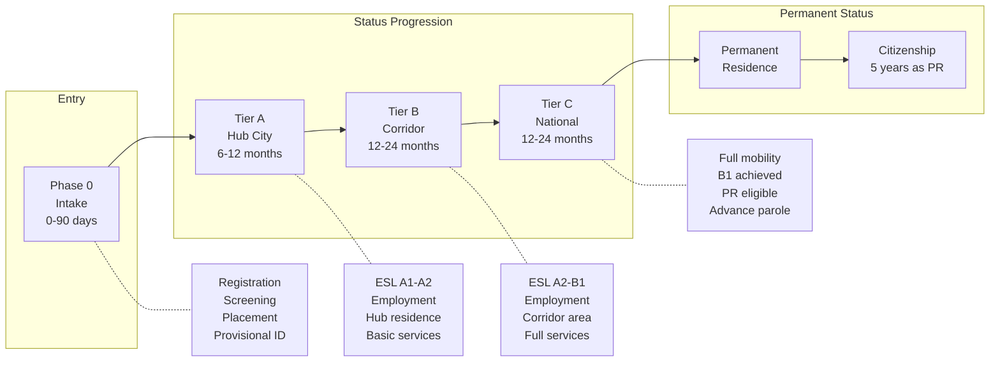
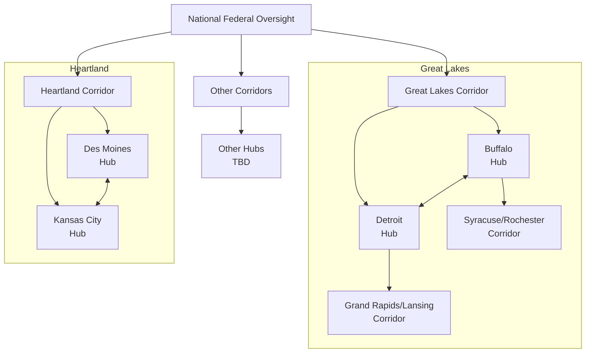
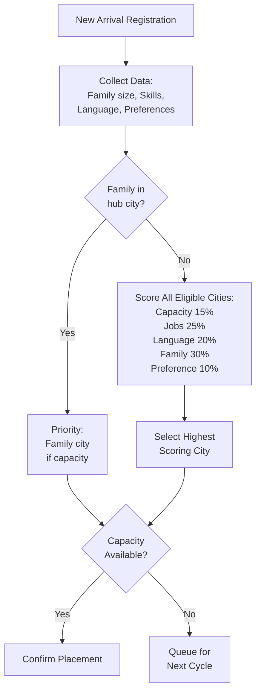
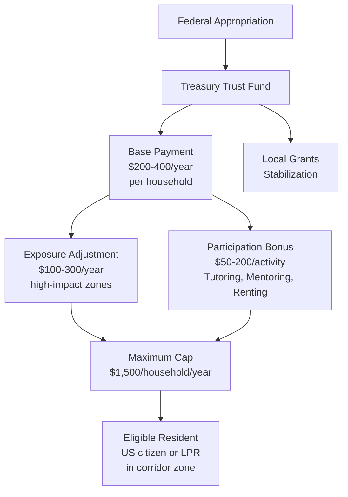
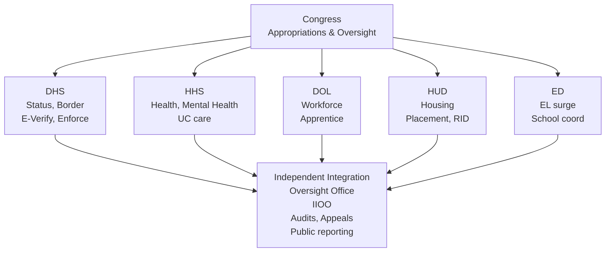
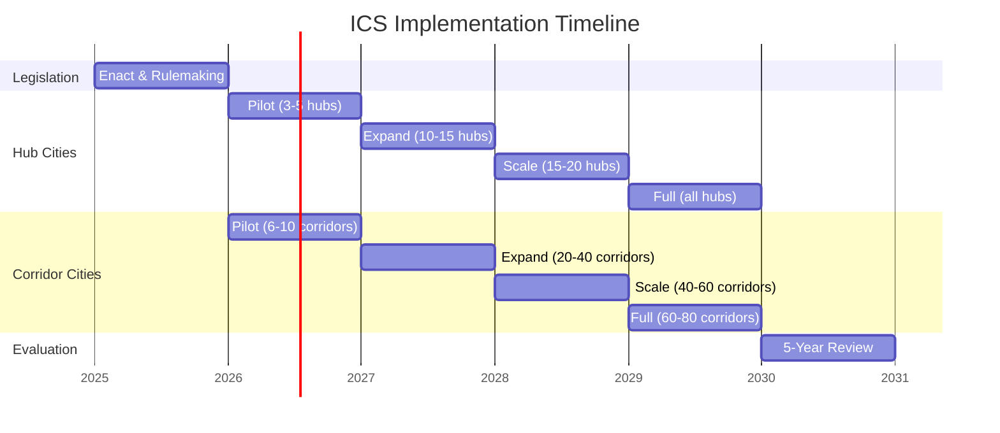
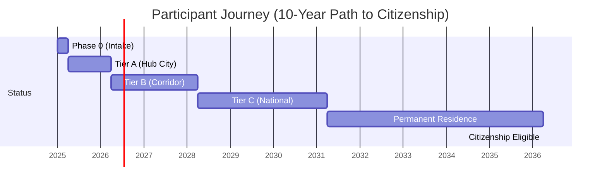
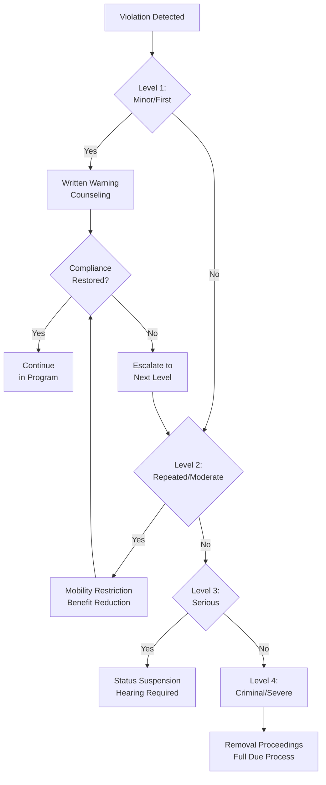

# Appendix M: Visual Diagrams

---

## Overview

This appendix provides visual representations of key ICS concepts, processes, and structures using Mermaid diagrams.

---

## System Overview

### ICS Status Progression

---

## Geographic Structure

### Hub and Corridor Cities

**Legend:**

- **Hub City:** Initial placement
- **Corridor City:** Secondary placement
- **↔:** Transfer possible within region

---

## Placement Algorithm

### Decision Flow

---

## Benefit Structure

### RID Payment Flow

---

## Agency Responsibilities

### Federal Agency Structure

---

## Timeline

### Implementation Timeline

**Milestones:**

- **Year 0:** Legislation enacted, rulemaking begins
- **Year 1:** First CLP participants placed in pilot cities
- **Year 2:** First cohort advances to Tier B; lessons learned applied
- **Year 3:** First cohort advances to Tier C; national expansion begins
- **Year 4:** Full national coverage; interstate compact operational
- **Year 5:** Comprehensive evaluation; first PR applications from early cohorts

---

## Participant Journey

### Individual Timeline

| Phase | Duration | Key Activities |
|-------|----------|----------------|
| **P0** | 90 days | Registration |
| **Tier A** | 1 year | Work, ESL A1, Hub only |
| **Tier B** | 2 years | Work/train, ESL B1, Corridor access |
| **Tier C** | 3-4 years | Full mobility, Advance parole |
| **PR** | 3-5 years | Apply for PR, Family sponsorship |
| **Citizenship** | 5+ years after PR | Apply for citizenship, Vote |

---

## Enforcement Escalation

### Compliance Response Levels

---

## Related Documents

- [System Architecture](../02-system-architecture.md) - Detailed structure
- [Geographic Design](../03-geographic-design.md) - Hub/corridor details
- [Implementation](../15-implementation.md) - Agency roles

---

## Document Navigation

- Previous: [Appendix L: Stakeholder Templates](L-stakeholder-templates.md)
- Next: [Appendix N: Research Gaps](N-research-gaps.md)
